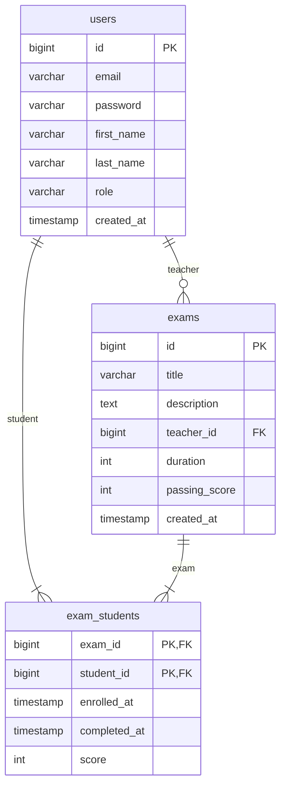

# Learning System - Платформа дистанционного обучения (Бета-версия)

## Текущий функционал (v0.5 Beta)

### Основные модули:
- **Аутентификация**:
  - Регистрация пользователей (преподаватели/студенты)
  - Авторизация с сессиями
  - Выход из системы

### Для преподавателей:
- **Создание/редактирование тестов**:
  - Название, описание
  - Длительность и проходной балл
- **Управление студентами**:
  - Добавление по email
  - Просмотр списка студентов
  - Удаление из курса
- **Просмотр результатов**:
  - Статистика по тестам
  - История прохождения

### Для студентов:
- **Личный кабинет**:
  - Просмотр профиля

## Планируемый функционал

### Ближайшие обновления:
- [ ] Система проведения тестирования
- [ ] Автоматическая проверка ответов
- [ ] Личный кабинет студента с прогрессом
- [ ] Уведомления о новых тестах

### Долгосрочная разработка:
- [ ] Мобильная версия
- [ ] API для интеграций
- [ ] Система отчетов (PDF/Excel)

## Технологии

### Backend:
- Java 21
- Spring Boot 3.2.0
- Spring Data JPA

### Frontend:
- Thymeleaf
- Vanilla JS
- CSS3 (без сторонних фреймворков)

## База данных: MySQL 8.0

### ER-диаграмма


## Структура проекта
    src/
    ├── main/
    │ ├── java/
    │ │ └── org/webproject/learningsystem/
    │ │ ├── controller/ # Контроллеры
    │ │ ├── dto/ # Data Transfer Objects
    │ │ ├── model/ # Сущности БД
    │ │ ├── repository/ # JPA-репозитории
    │ │ ├── service/ # Бизнес-логика
    │ └── resources/
    │ ├── static/ # Статические ресурсы
    │ │ ├── css/ # Стили
    │ │ ├── images/ # Изображения
    │ │ └── js/ # Скрипты
    │ ├── templates/ # HTML-шаблоны
    │ │ ├── student/ # Шаблоны для студента
    │ │ └── teacher/ # Шаблоны для преподавателя
    │ └── application.properties
    └── test/ # Тесты
## Установка

### Требования:
- JDK 21
- MySQL 8.0+
- Maven 3.9+

### Настройка:
```bash
git clone https://github.com/yourusername/learning-system.git
cd learning-system

# Настройте БД в src/main/resources/application.properties
nano src/main/resources/application.properties
